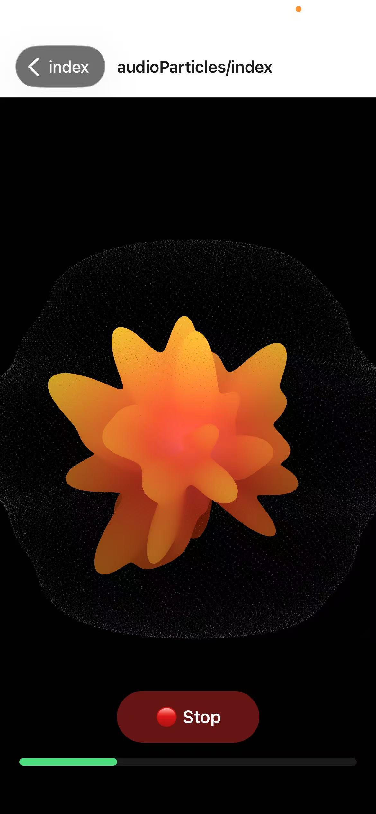
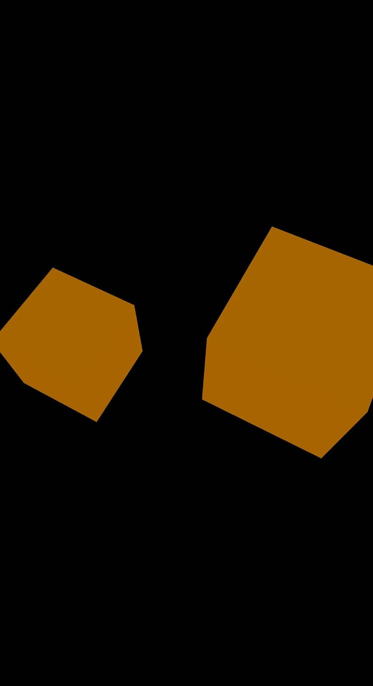

# Expo Three.js 演示

**[English](README.md) | 中文**

一个展示 Three.js 集成交互式 3D 图形和音频反应粒子效果的 React Native 应用程序。

## ✨ 特性

- **🎵 音频反应粒子**: 对麦克风输入响应的实时粒子系统
- **🎨 自定义着色器**: 用于有机动画的高级顶点和片段着色器
- **📱 跨平台**: 支持 iOS、Android 和 Web
- **⚡ 高性能**: 使用 Expo Three 为移动设备优化
- **🎯 交互式示例**: 具有不同效果的多个 3D 演示

## 🛠️ 使用的技术

- **[Expo](https://expo.dev/)** - 跨平台移动开发框架
- **[React Native](https://reactnative.dev/)** - 原生移动应用开发
- **[React Three Fiber](https://github.com/pmndrs/react-three-fiber)** - Three.js 的 React 渲染器
- **[Expo Three](https://github.com/expo/expo-three)** - Expo 的 Three.js 支持
- **[Expo Audio](https://docs.expo.dev/versions/latest/sdk/audio/)** - 实时音频处理
- **[TypeScript](https://www.typescriptlang.org/)** - 类型安全的 JavaScript

## 🚀 开始使用

### 前置要求

- Bun（推荐以获得更快性能）或 Node.js
- Expo CLI
- 用于测试的物理设备或模拟器

### 安装

```bash
# 克隆仓库
git clone https://github.com/your-username/expo-threejs-demo.git
cd expo-threejs-demo

# 安装依赖
bun install
```

### 运行应用

```bash
# 启动开发服务器
bun start
# 或者
bunx expo

# 平台特定构建
bun run android    # Android 开发
bun run ios        # iOS 开发
bun run web        # Web 开发

# 代码质量
bun run lint       # 运行 ESLint
```

## 📖 示例说明

### 🏠 主屏幕
展示所有可用 3D 演示的主界面，采用优雅的卡片式导航系统。

{:width="200"}

### 🎵 音频粒子
一个对环境声音或麦克风输入实时响应的迷人粒子系统。

**特性：**
- 实时音频捕获和处理
- 基于自定义着色器的粒子动画
- 使用 Simplex 噪声实现有机变形
- 基于音频振幅的动态颜色过渡

**使用方法：**
1. 导航到音频粒子示例
2. 点击"🎤 开始"开始音频录制
3. 发出声音或播放音乐观察粒子反应
4. 观看粒子基于声音振幅舞动和变形
5. 点击"🔴 停止"结束录制

{:width="200"}

### 🎲 简单网格
展示基本 3D 网格渲染、光照和材质效果的基础示例。

**特性：**
- 带旋转动画的交互式 3D 几何体
- 环境光和点光源的动态光照
- 缩放和颜色变化的触摸/手势交互
- 为移动设备优化的性能

**使用方法：**
1. 导航到简单网格示例
2. 点击网格进行缩放
3. 观察自动旋转动画
4. 体验流畅的 3D 渲染性能

{:width="200"}

---

*更多示例即将推出！每个示例都展示了 Three.js 与 React Native 集成的不同方面。*

## 🏗️ 项目结构

```
src/
├── app/                    # Expo Router 基于文件的路由
│   ├── (home)/            # 主页标签导航组
│   │   ├── index.tsx      # 带有示例卡片的主屏幕
│   │   ├── audioParticles/ # 音频反应粒子演示
│   │   └── sampleMesh/    # 基本网格渲染演示
│   └── _layout.tsx        # 根导航布局
├── components/            # 可重用组件
│   ├── ParticleEffectNative.tsx # 音频反应 3D 粒子系统
│   └── ExampleCard.tsx    # 主屏幕卡片组件
└── hooks/                 # 自定义 React 钩子
    └── useAudioAmplitude.ts # 音频录制和振幅提取
```

## 🎨 音频系统特性

- **实时处理**: 以可配置的轮询间隔捕获麦克风输入
- **振幅标准化**: 将音频电平（-60dB 到 0dB）转换为 0-1 范围以实现平滑动画
- **权限处理**: 自动麦克风权限请求，提供用户友好的提示
- **跨平台支持**: 在 iOS 和 Android 设备上保持一致工作

## 🧠 技术亮点

### 着色器编程
- 使用 Simplex 噪声的自定义顶点着色器实现有机变形
- 具有 HSV 颜色空间转换的片段着色器
- 为移动 GPU 性能优化

### 音频集成
- 启用计量功能的 Expo Audio API
- 实时振幅提取和标准化
- 50ms 间隔的平滑动画更新

### 3D 图形
- React Three Fiber 用于声明式 3D 场景
- 斐波那契球体分布实现均匀粒子间距
- 具有 162x162 球体几何体的高性能网格渲染

## 🤝 贡献

欢迎贡献！请随时提交 Pull Request。对于重大更改，请先开 issue 讨论您想要更改的内容。

## 📄 许可证

本项目采用 MIT 许可证 - 详情请参阅 [LICENSE](LICENSE) 文件。

## 🙏 致谢

- [React Three Fiber](https://github.com/pmndrs/react-three-fiber) 提供了出色的 Three.js React 渲染器
- [Expo](https://expo.dev/) 提供了优秀的开发平台
- [Three.js](https://threejs.org/) 社区提供的灵感和示例

## 📞 支持

如果您有任何问题或遇到问题，请：
- 查看 [Issues](https://github.com/your-username/expo-threejs-demo/issues) 页面
- 创建包含详细信息的新 issue
- 加入我们的 [Discord](https://discord.gg/expo) 社区获得实时支持

## 🌟 为什么选择这个项目？

这个项目展示了如何在 React Native 中实现复杂的 3D 图形和音频交互：

- **学习价值**: 了解 React Three Fiber 和 Expo Three 的实际应用
- **技术栈**: 现代化的移动开发技术栈，包括 TypeScript、Expo 和 Three.js
- **实际应用**: 可作为开发更复杂 3D 应用的起点
- **性能优化**: 专门为移动设备性能优化，适合实际产品使用
